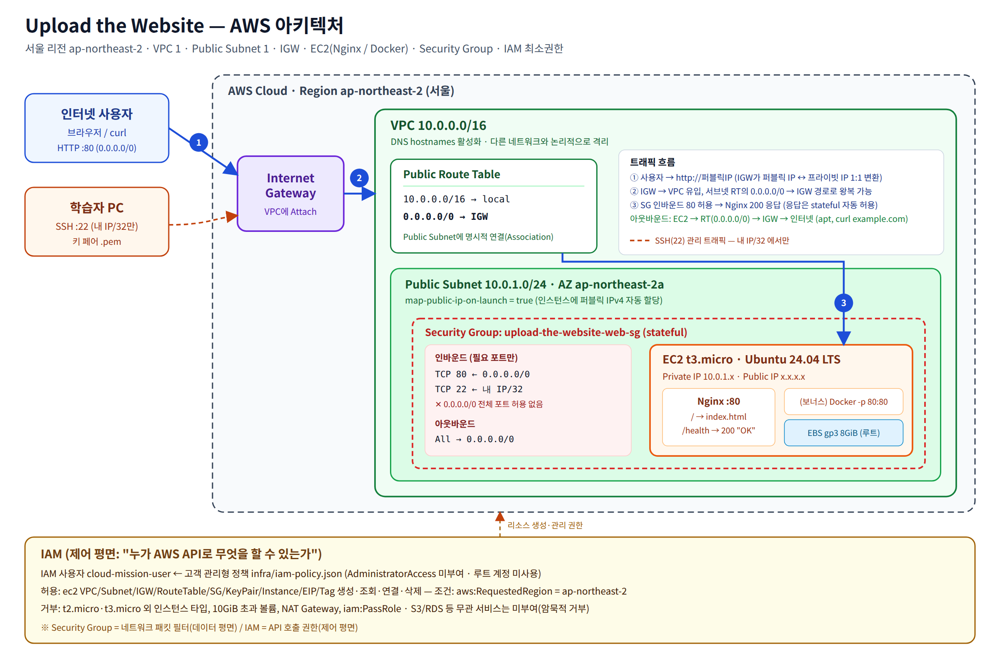
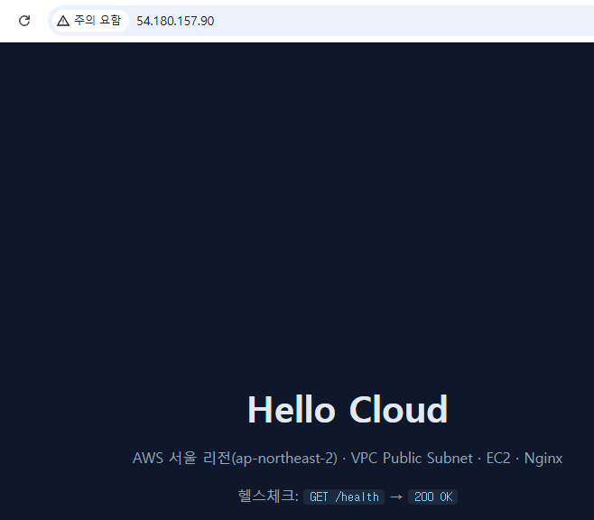
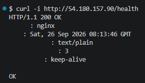
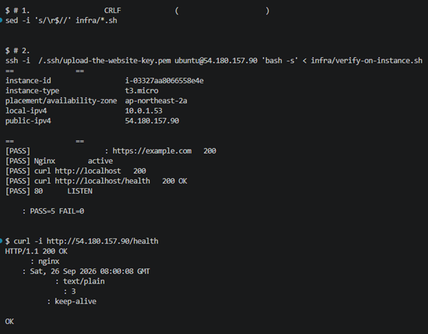
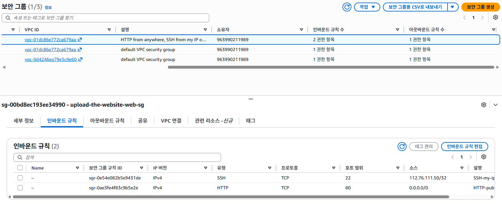
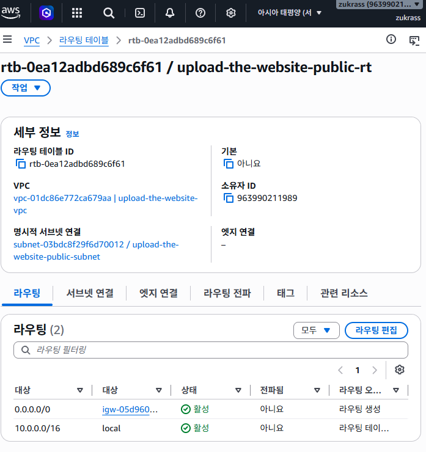
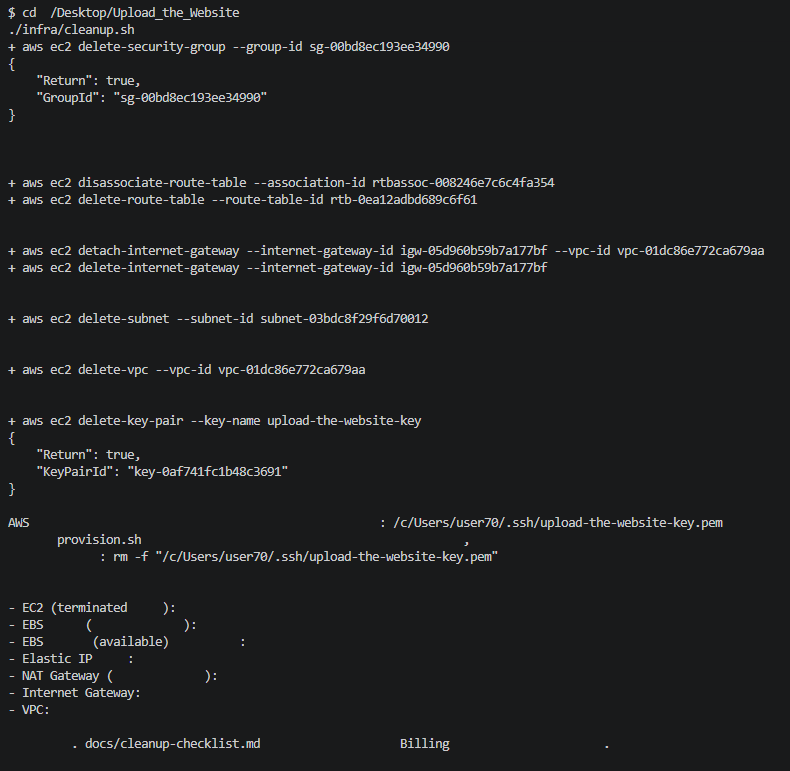
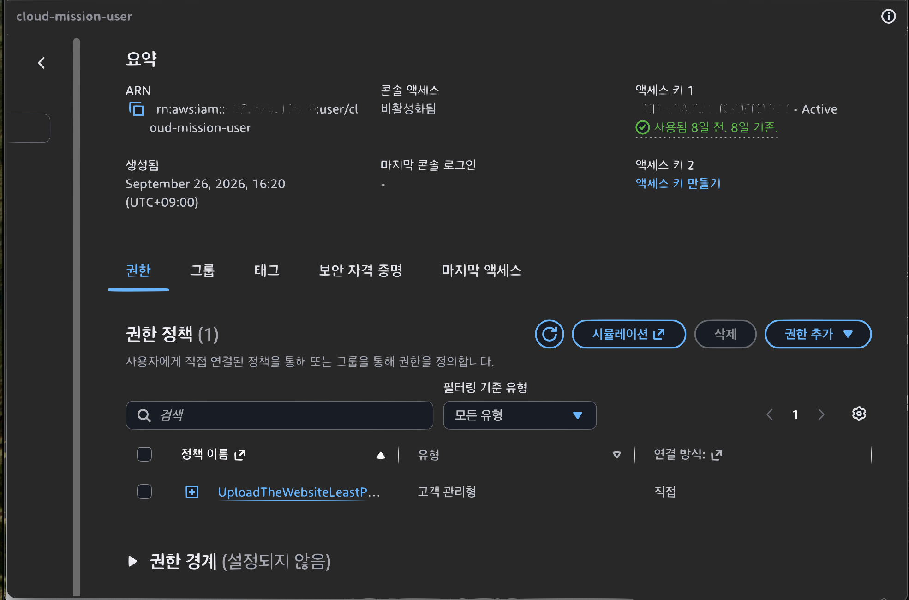
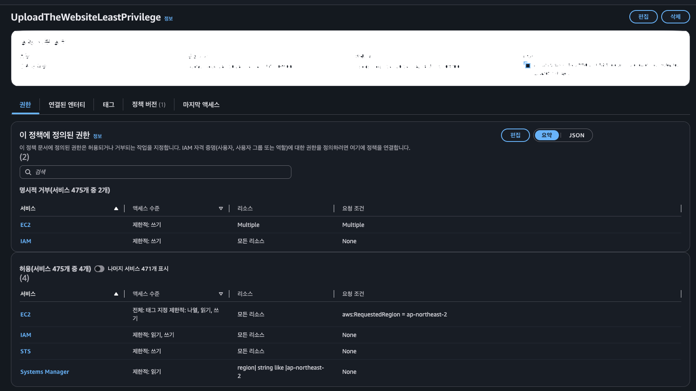
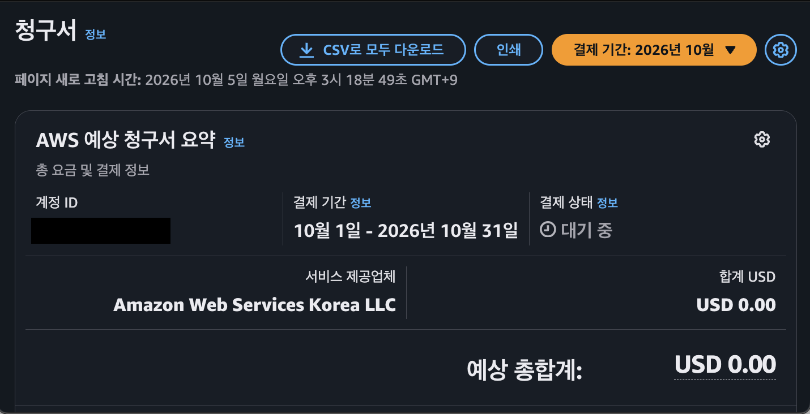

# Upload the Website

내가 만든 웹사이트를 AWS에 올려 **누구나 접속할 수 있게** 만드는 미션.
VPC로 네트워크를 격리하고, 보안 그룹과 IAM에 최소권한을 적용한 뒤, EC2에서 Nginx로 서비스한다.



## 제출물

| 결과물 | 위치 |
|--------|------|
| 아키텍처 다이어그램 | [`docs/architecture.png`](docs/architecture.png) (원본 [`architecture.svg`](docs/architecture.svg)) |
| 외부 접속 증빙 | 이 문서의 [외부 접속 검증](#외부-접속-검증) + [스크린샷](#스크린샷) ([`docs/screenshots/`](docs/screenshots/)) |
| 트러블슈팅 보고서 | [`docs/troubleshooting.md`](docs/troubleshooting.md) |
| 리소스 정리 체크리스트 | [`docs/cleanup-checklist.md`](docs/cleanup-checklist.md) |

## 구성 요약

| 구성 요소 | 값 | 역할 |
|-----------|-----|------|
| Region | `ap-northeast-2` (서울) | 모든 리소스 생성 위치 |
| VPC | `10.0.0.0/16` | 다른 네트워크와 격리된 사설 네트워크 경계 |
| Public Subnet | `10.0.1.0/24`, `ap-northeast-2a`, 퍼블릭 IP 자동 할당 | EC2가 놓이는 AZ 단위 IP 대역 |
| Internet Gateway | VPC에 attach | VPC와 인터넷 사이의 관문. 퍼블릭 IP와 프라이빗 IP를 1:1로 변환 |
| Route Table | `10.0.0.0/16 → local`, **`0.0.0.0/0 → IGW`**, Public Subnet에 연결 | "퍼블릭" 서브넷을 퍼블릭으로 만드는 핵심 설정 |
| Security Group | IN `80 ← 0.0.0.0/0`, `22 ← 내 IP/32` / OUT 전체 | 인스턴스(ENI) 단위 stateful 방화벽 |
| EC2 | `t3.micro`, Ubuntu 24.04 LTS, gp3 8GiB, IMDSv2 필수 | 웹 서버 |
| Web | Nginx: `/` → `index.html`, `/health` → `200 OK` | 서비스 |
| IAM | 사용자 1명 + [`infra/iam-policy.json`](infra/iam-policy.json) | AWS API 호출 권한(최소권한) |

### 외부 요청이 웹 서버에 닿기까지

1. 사용자가 `http://<퍼블릭IP>`로 요청하면 인터넷을 거쳐 **IGW**에 도착한다.
2. IGW가 목적지 퍼블릭 IP를 EC2의 프라이빗 IP(`10.0.1.x`)로 바꿔 VPC 안으로 넘긴다.
3. **Security Group**이 인바운드 TCP 80(0.0.0.0/0)을 허용하므로 패킷이 ENI를 통과한다.
4. Nginx가 응답한다. SG는 stateful이라 응답 트래픽은 따로 허용하지 않아도 나간다.
   응답은 서브넷 **Route Table**의 `0.0.0.0/0 → IGW` 경로를 따라 인터넷으로 돌아간다.

세 가지 중 하나라도 없으면 접속이 실패한다.
**IGW 경로**가 없으면 응답이 나갈 길이 없고, **퍼블릭 IP**가 없으면 외부에서 가리킬 주소가 없고, **SG 80 규칙**이 없으면 패킷이 버려진다.

### Security Group과 IAM의 차이

| | Security Group | IAM |
|---|---|---|
| 대상 | 네트워크 패킷(데이터 평면) | AWS API 호출(제어 평면) |
| 질문 | "이 IP에서 이 포트로 들어와도 되나?" | "이 사용자가 `RunInstances`를 호출해도 되나?" |
| 이번 적용 | 80만 전체 공개, 22는 내 IP만, 전체 포트 개방 없음 | EC2/VPC 작업만 서울 리전에서 허용, AdministratorAccess 없음 |

### IAM 최소권한 정책 ([`infra/iam-policy.json`](infra/iam-policy.json))

- **허용**: `ec2:Describe*`, VPC/Subnet/IGW/RouteTable/SG/KeyPair/Instance/EIP/Tag의 생성·연결·삭제.
  모두 `aws:RequestedRegion = ap-northeast-2` 조건을 건다. 퍼블릭 AMI ID 조회용 `ssm:GetParameter(s)`는 `/aws/service/*` 경로만 허용한다.
  권한 오류 분석용으로 `sts:DecodeAuthorizationMessage`, 콘솔 비밀번호 변경용으로 `iam:ChangePassword`를 허용한다.
- **명시적 거부**: `t2.micro`, `t3.micro` 외 인스턴스 타입, 10GiB를 넘는 볼륨, `ec2:CreateNatGateway`, `iam:PassRole`.
- **미부여(암묵적 거부)**: S3, RDS, Lambda, IAM 사용자/정책 관리 등 실습과 무관한 모든 서비스.

적용 방법(관리 권한이 있는 계정에서 한 번만 한다. 이후 작업은 모두 이 IAM 사용자로 한다):

1. IAM → 정책 → 정책 생성 → JSON 탭에 `infra/iam-policy.json`을 붙여 넣는다. 이름은 `UploadTheWebsiteLeastPrivilege`.
2. IAM → 사용자 생성 → `cloud-mission-user`(**콘솔 액세스 비활성화**, CLI 전용) → 위 정책**만** 직접 연결한다(그룹에 넣지 않는다. 인라인 정책도 추가하지 않는다).
3. CLI를 쓰려면 해당 사용자의 액세스 키를 발급해 `aws configure`로 설정한다. 리전은 `ap-northeast-2`.
4. 루트 계정은 MFA를 설정하고, IAM 초기 설정(정책·사용자 생성)과 IAM·Billing 증빙 화면 조회에만 사용한다. 실습 리소스 생성·삭제는 전부 `cloud-mission-user`로 했다.

**증빙(실제로 실습에 쓴 `cloud-mission-user`에 이 정책 하나만 붙어 있는지 확인)**: `cloud-mission-user`는 이 정책에 `iam:List*`/`iam:Get*` 권한이 없어 스스로를 조회할 수 없다(이 자체가 권한이 넓지 않다는 증거이기도 하다). 그래서 **관리자 자격 증명**으로 아래를 실행해 확인한다.

```bash
./infra/verify-iam-user.sh cloud-mission-user
```

`list-attached-user-policies`(관리형 정책 1개, `UploadTheWebsiteLeastPrivilege`), `list-user-policies`(인라인 정책 0개), `list-groups-for-user`(소속 그룹 0개), 그리고 연결된 정책 문서가 `infra/iam-policy.json`과 일치하는지를 각각 PASS/FAIL로 출력한다. 콘솔로도 IAM → 사용자 → `cloud-mission-user` → **권한** 탭에서 정책이 한 개뿐임을 눈으로 확인할 수 있다(스크린샷 증빙: 아래 [스크린샷](#스크린샷) 섹션의 `iam-permissions.png` 참고).

## 배포 방법

### 사전 준비

- AWS CLI v2와 `cloud-mission-user` 자격 증명이 필요하다(`aws sts get-caller-identity`로 루트가 아닌지 확인).
- Bash, `curl`, `base64`. macOS 기본 터미널(zsh)과 Linux Bash 모두 그대로 지원한다.
  Windows는 기본 PowerShell이 아니라 **Git Bash** 또는 **WSL**에서 실행한다.
- 스크립트에 실행 권한이 없다면(`Permission denied`) `chmod +x infra/*.sh`를 한 번 실행한다.

### 자동 배포(CLI)

```bash
./infra/provision.sh              # 호스트에 Nginx 설치(기본)
# 또는
MODE=docker ./infra/provision.sh  # 보너스 2: Docker 컨테이너로 실행
```

스크립트는 VPC, Subnet, IGW, RT, SG(내 IP 자동 감지), Key Pair(`~/.ssh/upload-the-website-key.pem`), EC2 순으로 생성하고
만든 리소스 ID를 `infra/.state.env`에 기록한다(git에는 포함되지 않음). 부팅 스크립트는
[`infra/user-data-nginx.sh`](infra/user-data-nginx.sh) / [`infra/user-data-docker.sh`](infra/user-data-docker.sh)이며
[`app/index.html`](app/index.html)과 [`app/nginx.conf`](app/nginx.conf)를 그대로 설치한다.

### 콘솔로 직접 만들 때(같은 결과)

1. VPC → **VPC만** 생성, `10.0.0.0/16`
2. 서브넷 생성 `10.0.1.0/24`, `ap-northeast-2a` → 서브넷 설정 편집에서 "퍼블릭 IPv4 주소 자동 할당" 체크
3. 인터넷 게이트웨이 생성 → VPC에 연결
4. 라우팅 테이블 생성 → 라우팅 편집 `0.0.0.0/0 → igw-…` → 서브넷 연결 편집에서 Public Subnet 선택
5. 보안 그룹 생성: 인바운드 `HTTP 80 / 0.0.0.0/0`, `SSH 22 / 내 IP`
6. EC2 시작: Ubuntu 24.04, t3.micro, 키 페어 생성, 위 VPC/서브넷/SG 선택, 스토리지 8GiB gp3, 고급 세부 정보 → 사용자 데이터에 `user-data-nginx.sh` 내용 입력(자리표시자를 치환한 버전은 `provision.sh`가 생성한다. 콘솔에서는 SSH로 접속해 `app/` 파일을 직접 복사해도 된다)

### 인스턴스 내부 점검(요구사항 자동 확인)

```bash
ssh -i ~/.ssh/upload-the-website-key.pem ubuntu@<퍼블릭IP> 'bash -s' < infra/verify-on-instance.sh
```

다음 항목을 PASS/FAIL로 출력한다. `curl https://example.com`(아웃바운드), Nginx(또는 컨테이너) 실행 상태,
`curl http://localhost` → 200, `/health` → `OK`, 80 포트 LISTEN.

## 외부 접속 검증

> **선택한 방식: (B) `GET http://<퍼블릭IP>/health` → `200 OK`, 본문 `OK`**
> (같은 서버에서 (A) 브라우저 `http://<퍼블릭IP>`도 "Hello Cloud" 페이지를 보여 준다.)

| 항목 | 값 |
|------|----|
| 퍼블릭 IP | `54.180.157.90` |
| 검증 URL | `http://54.180.157.90/health` |
| 검증 일시 | 2026-09-26 17:13 KST |

> 검증 후 과금 방지를 위해 리소스를 모두 정리했으므로([정리 체크리스트](docs/cleanup-checklist.md)) **현재 위 IP로는 접속되지 않는다.** 접속 결과는 아래 로그와 스크린샷으로 확인한다.

외부 PC(인스턴스 밖, Windows/Git Bash)에서 실행했다.

```bash
$ curl -i http://54.180.157.90/health
HTTP/1.1 200 OK
Server: nginx
Date: Sat, 26 Sep 2026 08:13:46 GMT
Content-Type: text/plain
Content-Length: 3
Connection: keep-alive

OK
```

브라우저로 `http://54.180.157.90` 접속해도 "Hello Cloud" 페이지가 정상 표시됨을 확인했다.

증빙 스크린샷은 [`docs/screenshots/`](docs/screenshots/)에 있다. 전체 목록과 미리보기는 아래 [스크린샷](#스크린샷) 섹션 참고.

## 스크린샷

전체 파일은 [`docs/screenshots/`](docs/screenshots/)에 있다.

| | |
|---|---|
| **외부 접속 — 브라우저 (A)**<br>[`browser.png`](docs/screenshots/browser.png)<br>`http://54.180.157.90` 접속, "Hello Cloud" 페이지 정상 표시 | **외부 접속 — 헬스체크 (B, 선택 방식)**<br>[`health-200.png`](docs/screenshots/health-200.png)<br>`curl -i http://54.180.157.90/health` → `200 OK` / `OK` |
|  |  |
| **인스턴스 내부 점검**<br>[`verify-on-instance.png`](docs/screenshots/verify-on-instance.png)<br>`infra/verify-on-instance.sh` 실행 결과, 5개 항목 전부 `PASS` | **Security Group 인바운드 규칙**<br>[`security-group.png`](docs/screenshots/security-group.png)<br>HTTP 80은 `0.0.0.0/0`, SSH 22는 내 IP `/32`만 허용 |
|  |  |
| **Route Table 경로**<br>[`route-table.png`](docs/screenshots/route-table.png)<br>`0.0.0.0/0 → igw-...`(활성), `10.0.0.0/16 → local` | **리소스 정리(cleanup.sh) 실행 로그**<br>[`cleanup-terminal.png`](docs/screenshots/cleanup-terminal.png)<br>EC2/EBS/EIP/NAT/IGW/VPC 잔여 리소스 확인 결과 |
|  |  |

**IAM 최소권한 증빙** (계정 ID·액세스 키 ID는 가림)

| | |
|---|---|
| **사용자 권한 탭**<br>[`iam-permissions.png`](docs/screenshots/iam-permissions.png)<br>`cloud-mission-user`에 고객 관리형 정책 `UploadTheWebsiteLeastPrivilege` **1개만 직접 연결**, 그룹 0개 | **정책 요약**<br>[`iam-policy-summary.png`](docs/screenshots/iam-policy-summary.png)<br>허용 서비스 475개 중 **4개**(EC2·IAM·STS·SSM), EC2는 `ap-northeast-2` 조건, 명시적 거부 2개 |
|  |  |

**과금 확인** — [`billing.png`](docs/screenshots/billing.png)
리소스 정리 후 Billing 콘솔에서 예상 총합계 **USD 0.00** 확인 (2026-10-05).



## 보너스 2: Docker 컨테이너 배포

| 항목 | 값 |
|------|----|
| 베이스 이미지 | `nginx:1.27-alpine` |
| 실행 이미지 | `hello-cloud:1.0` ([`docker/Dockerfile`](docker/Dockerfile)로 인스턴스에서 빌드) |
| 실행 방식 | `docker run -d --name hello-cloud --restart unless-stopped -p 80:80 hello-cloud:1.0` |
| 포트 매핑 | **호스트 80 → 컨테이너 80** (SG 80 → EC2:80 → 컨테이너:80) |
| 헬스체크 | Dockerfile `HEALTHCHECK`가 30초마다 `/health`를 확인해 `docker ps`에 `(healthy)`로 표시 |

로컬에서 먼저 확인하기:

```bash
docker build -f docker/Dockerfile -t hello-cloud:1.0 .
docker run -d --name hello-cloud -p 8080:80 hello-cloud:1.0
curl -i localhost:8080/health   # 200 OK / OK
```

EC2에서 검증:

```bash
MODE=docker ./infra/provision.sh
ssh -i ~/.ssh/upload-the-website-key.pem ubuntu@<IP> 'docker ps && curl -si http://localhost/health'
curl -i http://<IP>/health      # 외부 PC에서 실행
```

증빙 스크린샷: `docs/screenshots/docker-ps.png`(컨테이너 `Up` 상태), `docs/screenshots/docker-external.png`(외부 `/health` 결과)

## 정리(과금 방지)

```bash
./infra/cleanup.sh
```

EC2 종료, EIP 해제, SG, RT, IGW Detach/삭제, Subnet, VPC, Key Pair 순서로 삭제한 뒤 남은 리소스를 조회해 출력한다.
결과는 [`docs/cleanup-checklist.md`](docs/cleanup-checklist.md)에 기입한다.

## 디렉터리 구조

```
app/        index.html, nginx.conf (호스트 Nginx와 Docker가 같은 설정을 사용)
docker/     Dockerfile (보너스 2)
infra/      iam-policy.json, provision.sh, cleanup.sh, user-data-*.sh, verify-on-instance.sh, verify-iam-user.sh
docs/       architecture.(svg|png), troubleshooting.md, cleanup-checklist.md, screenshots/
```
